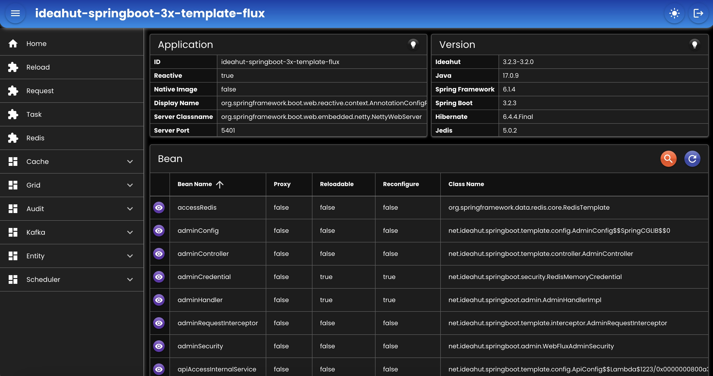

# Spring Boot 3x Template (WebFlux)  

- Template implementasi dari Ideahut Springboot 3x Library (WebFlux).
- Dokumentasi dapat dilihat di [Ideahut Springboot](https://github.com/ideahut-apps-team/ideahut-springboot-docs/)

## Admin
- `URL`  : http://localhost:5401/_/web
- `User` : admin
- `Pass` : password

   

## Native
Template untuk Native Image bisa dilihat di [sini](https://github.com/thomson470/ideahut-springboot-3x-template-flux-native/)

##

### [Index](https://github.com/thomson470/Ideahut-Template)